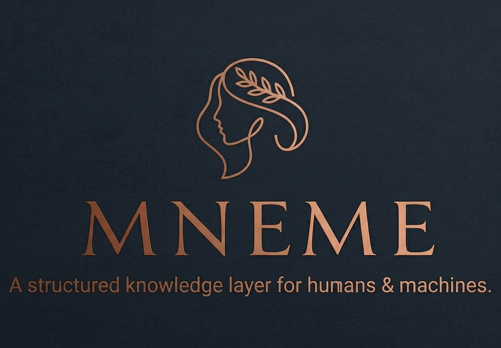

<p align="center">
  
</p>

<h1 align="center"></h1>


A CLI tool that turns your documents into a searchable second brain. Drop files in, get a structured knowledge layer out -- browsable by humans in Obsidian, queryable by machines in under 5ms.

```bash
pip install -e .
mnemo init --project "My Research" --clients "acme-corp"
mnemo ingest proposal.pdf acme-corp
mnemo search "delivery timeline"
```

That's it. Your knowledge compounds instead of decaying.

---

## Why

You're building a medical device. You have a risk analysis in a PDF, user needs in a spreadsheet, meeting notes in markdown, and 47 requirements in a CSV. An auditor asks "show me the trace from hazard HAZ-001 to the test that verifies its mitigation." You spend two hours searching folders.

Mnemo fixes this:

```bash
# Import everything
mnemo ingest risk-analysis.pdf cardio-monitor
mnemo ingest-csv user-needs.csv cardio-monitor --mapping user-needs
mnemo ingest-csv risk-register.csv cardio-monitor --mapping risk-register

# Answer the auditor in 2 seconds
mnemo trace show cardio-monitor/haz-001 --direction forward
#   haz-001 (Electrical Shock)
#     mitigated-by -> rma-003 (Insulation Barrier)
#       implemented-by -> req-007 (Double Insulation)
#         verified-by -> test-042 (Dielectric Strength Test)

# Find gaps before the auditor does
mnemo trace gaps cardio-monitor
#   Requirements with no verification: req-011, req-023
#   Hazards with no mitigation: haz-009
```

Every document ingested once. Every trace link tracked. Every vocabulary term harmonized. Every gap found automatically.

No databases. No servers. No infrastructure. Plain markdown files + JSON schemas that any system can read.

---

## Install

```bash
git clone https://github.com/tolism/mnemo.git
cd mnemo
pip install -e .
```

You now have the `mnemo` command globally. Verify with `mnemo stats`.

**Optional:** For PDF support, install with `pip install -e ".[pdf]"`. For everything, `pip install -e ".[all]"`.

**Requirements:** Python 3.9+. Works on macOS, Linux, Windows.

---

## Quick Start

```bash
# Initialize a knowledge base
mnemo init --project "My Project" --clients "client-a,client-b"

# Ingest some documents
mnemo ingest report.pdf client-a
mnemo ingest meeting-notes.md client-a
mnemo ingest market-research.txt client-b

# Search across everything
mnemo search "quarterly budget"

# Check health
mnemo stats

# Launch the web dashboard
python3 server.py    # http://localhost:3141
```

### Try the demo

```bash
mnemo ingest demo/sample-proposal.md demo-retail
mnemo ingest demo/sample-meeting-notes.md demo-retail
mnemo ingest demo/sample-research.md demo-retail
mnemo search "RetailCorp budget"
```

---

## CLI

| Command | What It Does |
|---|---|
| `mnemo init` | Scaffold a new knowledge base |
| `mnemo ingest <file> <client>` | Ingest a source document |
| `mnemo search "<query>"` | Search across all layers |
| `mnemo sync` | Sync wiki to Memvid memory |
| `mnemo drift` | Detect layer desynchronization |
| `mnemo stats` | Health overview |
| `mnemo repair` | Fix corrupted archives |

**Formats:** `.md`, `.txt`, `.pdf`

---

## How It Works

```
    Your Document
         |
         v
    mnemo ingest
         |
         +---> Wiki Layer (markdown, Obsidian-compatible)
         |       Frontmatter, citations, [[wikilinks]]
         |       You read and browse here
         |
         +---> Memory Layer (.mv2 archive)
         |       Smart Frames, semantic embeddings
         |       Machines query here (<5ms)
         |
         +---> Schema Layer (JSON)
                 entities.json - people, companies, products
                 graph.json   - relationships between entities
                 tags.json    - taxonomy
```

Every `mnemo ingest` writes both layers atomically. `mnemo drift` catches desync. `mnemo repair` fixes it.

**Memvid is optional.** Without it, mnemo runs as a wiki-only knowledge base with text search. Add `memvid-sdk` when you outgrow grep.

---

## Web Dashboard

`python3 server.py` -- opens at `http://localhost:3141`

- **Dashboard** -- stats, per-client counts, activity log
- **Search** -- dual-layer results with source attribution
- **Wiki** -- browse all pages with rendered markdown
- **Entities** -- filterable table of extracted entities
- **Health** -- drift status, sync state

---

## When You Need This

| Scale | Wiki alone | Wiki + Memvid |
|---|---|---|
| 5 docs | Plenty | Overkill |
| 50 docs | Fine | Starting to help |
| 500 docs | Grep takes 2-3s, misses semantic matches | 2ms, cross-client connections |
| 5,000 docs | Unusable | Still 2ms |

Start wiki-only. Add the memory layer when search gets slow.

---

## Project Structure

```
mnemo/
  sources/        Raw documents (immutable, never modified)
  wiki/           Markdown knowledge pages (Obsidian-compatible)
  schema/         entities.json, graph.json, tags.json
  memvid/         .mv2 memory archives
  core.py         Engine (ingest, search, sync, drift, repair)
  config.py       Configuration
  server.py       Web dashboard
  index.md        Master page catalog
  log.md          Activity timeline
```

---

## Downstream Use

Mnemo outputs plain files -- markdown and JSON. Any system can read them. The CLI is designed to be called programmatically by other applications.

**Next up:** Mnemo as the knowledge backend for a QMS (Quality Management System) -- quality documentation, audit trails, compliance evidence, all searchable.

---

## Credits

This project builds on two foundational ideas:

- **LLM Wiki pattern** by [Andrej Karpathy](https://gist.github.com/karpathy/442a6bf555914893e9891c11519de94f) -- the insight that LLMs should build and maintain a persistent, compounding wiki instead of re-deriving answers from raw documents on every query
- **Memvid** by [Olow304/memvid](https://github.com/Olow304/memvid) -- single-file AI memory with sub-millisecond retrieval, no vector DB required
- **Original implementation** -- [tashisleepy/knowledge-engine](https://github.com/tashisleepy/knowledge-engine) -- the first version that fused both patterns into a dual-layer bridge

---

## License

MIT
